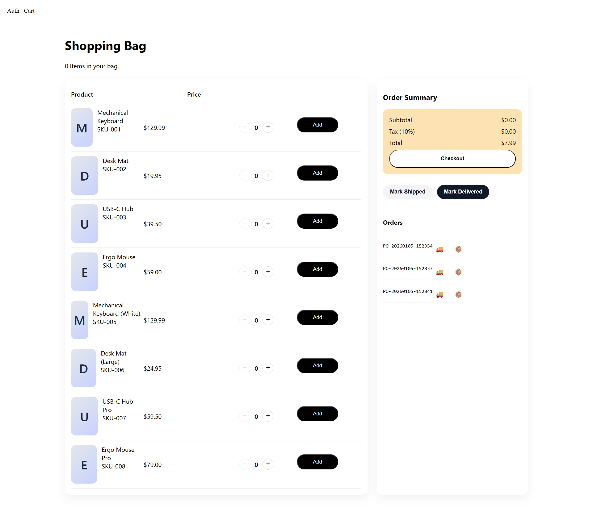

# 🛒 Mini Cart API — PHP Session-Backed Server



- ✅ User authentication (signup/login/logout)
- 🛍️ Catalog listing
- 🧾 Cart + order management
- 💳 Payment → shipping → delivery → archive
- 📦 JSON-based storage (no DB)
- 🔁 Manual order reset for testing
- 🧮 NDJSON event logging

| Endpoint      | Method | Description                                        |
| ------------- | ------ | -------------------------------------------------- |
| `/api/signup` | POST   | Create new user (`email`, `password`) → auto login |
| `/api/login`  | POST   | Login user → sets session                          |
| `/api/logout` | POST   | Logout + clear session + reset order               |
| `/api/me`     | GET    | Return current session user or null                |


Run it locally:
```bash
php -S 127.0.0.1:8081
```

## Heads up!! 

#### Next Steps

- Add password reset / profile update

- Swap file storage for SQLite or MySQL

- Deploy to Apache or Nginx + PHP-FPM

- Add /api/stats for analytics